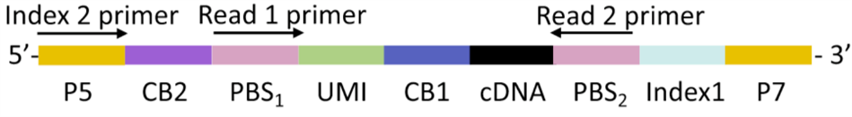

# MobiVision-M Custom Library Structure Analysis Pipeline

## Input Preparation

MobiVision-M reads a configuration to obtain library structure information. The configuration file must provide the paths of the input- and output-structure description files.  
The input-structure file describes which reads in the sequencing results match the library design.  
The output-structure file specifies how reads that pass the filter should be formatted for output.  

### Input-structure file
The input-structure file is a tab-delimited text file (.tsv).
Each line describes a specific sequence segment called an element. For every read, MobiVision-M checks in order whether all elements are present. Only reads that contain every element are retained.

#### Example
| ID | name     | pos | start            | end | seq               | length | mismatch | Npolicy |
|----|----------|-----|------------------|-----|-------------------|--------|----------|---------|
| 0  | UMI      | C:1 | C:0              | C:7 | N:N               | C:8    | C:0      | hard    |
| 1  | barcode1 | C:1 | D:UMI,end,0      | N:N | F:BacDrop_BC.csv  | C:13   | C:1      | soft    |
| 2  | barcode2 | C:1 | C:barcode1,end,0 | N:N | F:BacDrop_BC2.csv | C:16   | C:2      | soft    |
| 3  | target   | C:2 | C:0              | N:N | N:N               | N:N    | C:0      | hard    |

The file above describes the library design shown below:


#### ID
Sequential number; MobiVision-M tests elements in this order.  

#### name
Element identifier. Lines sharing the same name represent the same element. Satisfying any one of them counts as a successful match.   

#### pos 
Sequencing location of the element.  
The field is colon-delimited: the first segment is the type, the second is the value.  
Allowed types are C, D, or R.  
- C: the element is fixed to a specific read file; the value is that file’s flag.
- D: the element resides in the same file as its dependency element; the value is the dependency element’s name.
- R: the element is placed in the opposite file (R1↔R2, 1↔2) relative to its dependency element; the value is the dependency element’s name.  

MobiVision-M locates files with the regex pattern "prefix_flag_postfix.fastq.gz", where flag equals the pos value. Both underscores (_) and dots (.) are accepted, and the extensions fastq.gz, fq.gz, fastq, and fq are recognized.

#### start
Start position of the element.  
The field is colon-separated: the first part is the type, the second part is the value.  
Accepted types are C, D, or N.  
- C: the element’s start position is fixed; the value is the coordinate.  
- D: the element’s start position is defined relative to a dependency element; the value is comma-separated in the format: dependency element name, dependency element attribute, offset.  
- N: the element’s start position is undetermined; the value is always N.   

#### end
Stop position of the element.  
The field is colon-delimited: the first segment is the type, the second is the value.  
Allowed types are C, D, or N.  
- C: the element’s end position is fixed; the value is the coordinate.  
- D: the element’s end position is calculated relative to a dependency element; the value is comma-separated as: dependency element name, dependency element attribute, offset.  
- N: the element’s end position is undetermined; the value is always N.  

#### seq
Whitelist sequence(s) of the element.  
The field is colon-separated: the first part is the type, the second part is the value.  
Accepted types are C, F, N, or H.  
- C: the whitelist is fixed. The value is a comma-separated list of short, constant sequences.  
- F: the whitelist is fixed but stored externally; the value is the filename of a comma-separated text file (.csv, see example below).
- N: no whitelist is applied; the value must be N.  
- H: the sequence is extracted directly from the read header using a regular expression; the value is the regex pattern.  

N bases are allowed in whitelist sequences and never count as mismatches.  
Whitelist files must be placed in the same directory as the input-structure file.  
A whitelist file is a comma-separated text file in the form:  
| index | seq           |
|-------|---------------|
| 0     | AAGTGATTAGCAA |
| 1     | AGAATCCCCCTAA |
| 2     | ACCTGGGAAACTA |
| 3     | ATACCTCCCAGGA |
| 4     | AATTTGTGGTATA |
| 5     | ACCCGAGAGATCA |
| 6     | AGAGTATAGGGTA |
| 7     | ATCTTAATTGAGA |

#### length
Length of the element.  
The field is colon-separated: the first part is the type, the second part is the value.  
Accepted types are C or N.  
- C: the element has a fixed length; the value is the length.
- N: the element has a variable length; the value is always N.

#### mismatch
Element’s tolerance for base mismatches.  
The field is colon-separated: the first part is the type, the second part is the value.  
Accepted types are C or P.  
- C: a fixed number of mismatched bases is allowed; the value is that count.
- P: a proportion of mismatched bases is allowed; the value is that fraction.

#### Npolcy
How the element treats N bases in the read.  
When an N is present in the sequencing read:  
- If Npolicy is hard, the N is counted as a mismatch unless the whitelist sequence also has an N at that position.
- If Npolicy is soft, the N is ignored and does not count as a mismatch.

### Output-structure file

#### Example
| ID | pos | order | name     | seq | type    | start | end |
|----|-----|-------|----------|-----|---------|-------|-----|
| 0  | R1  | 0     | barcode1 | T   | barcode | N     | N   |
| 1  | R1  | 1     | barcode2 | T   | barcode | N     | N   |
| 2  | R1  | 2     | UMI      | Q   | UMI     | N     | N   |
| 3  | R2  | 0     | target   | Q   | seq     | N     | N   |

The output structure above writes barcode1, barcode2, and UMI in order to R1.  
For barcodes, the matched whitelist sequences are written; for the UMI, the sequence detected in the read is written.  
At the same time, the target sequence (i.e., the full-length detected R2 read defined in the input structure) is written to R2.
MobiVision-M expects R1 to contain only barcode + UMI and R2 to retain the detected target sequence.

##### ID
Sequential number. MobiVision-M outputs elements in this order.

#### pos
Read file (R1 or R2) to which the element is written.

#### order
Zero-based output order within the chosen read file. Ordering is independent between R1 and R2.

#### name
Element identifier, which must match the corresponding name in the input-structure file.

#### seq
Accepted values are Q or T.
- Q: write the detected sequence (from the input FASTQ).
- T: write the matched whitelist sequence.

#### type
Output category. At least one barcode and one UMI entry must be present.

#### start
Start coordinate of the segment to write. N means “from the first base”.

#### end
Stop coordinate of the segment to write. N means “to the last base” (full length).

## Configuration
Custom library structures must be supplied to MobiVision-M through an INI-format configuration file, for example:  
```ini
[MobiVision-M]
filter_pattern_file=lib_structure_BacDrop.tsv
output_pattern_file=output_structure_BacDrop.tsv
output_type=Custom
encrypt=NA
encrypt_key=NA
seq_barcode_tag=barcode
barcode_len=29
seq_UMI_tag=UMI
UMI_start=30
UMI_len=8
split_by=NA
process_cutadapt=False
process_fastp=False
```
Where：  
- filter_pattern_file: input-structure file.
- output_pattern_file: output-structure file.
- output_type: always Custom.
- encrypt: always NA.
- encrypt_key: always NA.
- seq_barcode_tag: the name used for barcode in the output-structure file.
- barcode_len: total barcode length.
- seq_UMI_tag: the name used for UMI in the output-structure file.
- UMI_len: UMI length.
- split_by: always NA.
- process_cutadapt: always False; adapter trimming should be done before MobiVision-M.
- process_fastp: always False; low-quality or otherwise unwanted reads should be removed before MobiVision-M.
  
## Usage
Run with the following command:
```bash
mobivision-M quantify \
  -f data_dir \      # replace with path to the folder containing the raw sequencing data
  -t 12 \            # number of threads
  -i reference \     # replace with path to the reference folder
  -s ID \            # replace with sample ID
  -o output_dir \    # replace with desired output directory
  --config config_dir # replace with path to the config file
```
Compared to the standard run, only the --config argument is added.  
The output is identical to the standard pipeline.  
