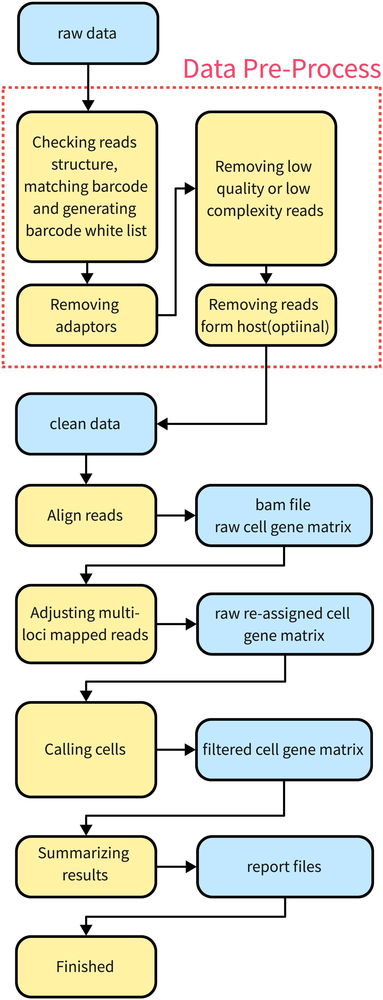
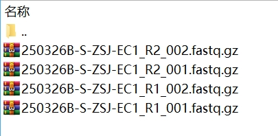

<main>

# MobiVision®-M Software Introduction

- [MobiVision®-M Software Introduction](#mobivision-m-software-introduction)
  - [Overview](#overview)
  - [Basic Analysis Workflow](#basic-analysis-workflow)
  - [Detailed Algorithms \& Workflow](#detailed-algorithms--workflow)
    - [Data Preprocessing Workflow](#data-preprocessing-workflow)
    - [UMI Correction Algorithm](#umi-correction-algorithm)
    - [Multi-Location Alignment Reads Correction Algorithm](#multi-location-alignment-reads-correction-algorithm)
    - [Call Microbe Algorithm](#call-microbe-algorithm)
    - [Multiplet Detection Algorithm](#multiplet-detection-algorithm)
  - [FAQ](#faq)
    - [How to Install the Software](#how-to-install-the-software)
    - [Requirements for Input Fastq Files](#requirements-for-input-fastq-files)
    - [Do I Need to Merge Data from Multiple Sequencing Runs in Advance](#do-i-need-to-merge-data-from-multiple-sequencing-runs-in-advance)
    - [Differences Between raw\_cell\_gene\_matrix and raw\_re-assigned\_cell\_gene\_matrix](#differences-between-raw_cell_gene_matrix-and-raw_re-assigned_cell_gene_matrix)
    - [What to Do If the Number of Cells Is Too Low or the Median Gene Count Is Too Low](#what-to-do-if-the-number-of-cells-is-too-low-or-the-median-gene-count-is-too-low)
    - [Why There Is No Bam File Output](#why-there-is-no-bam-file-output)

<hr>

## Overview

MobiVision®-M is a command-line software specifically designed for analyzing single-cell microbial transcriptome sequencing data from the MobiMicrobe® high-throughput microbial single-cell transcriptome kit.  
MobiVision®-M starts from the raw sequencing data, and goes through a series of processes including data preprocessing, quality control, alignment, correction of multi-position alignment reads, matrix generation, and analysis report generation, to automatically provide quality control results, single-microbe gene expression matrices, and web-formatted analysis reports.  
In addition, MobiVision®-M can also build a reference based on a genome sequence file and a gene annotation file, or re-call microbes from an already analyzed results without running the entire alignment analysis workflow.

<hr>

## Basic Analysis Workflow

The basic analysis workflow of the software is as follows:  
  
In the figure, the blue parts represent data, and the yellow parts represent processes.  
The raw sequencing data first undergoes preprocessing, including barcode detection, adapter removal, low-quality or too-short reads removal, and optional host removal. The output is referred as "clean data".  
The R1 part of the clean data consists of each reads' barcode + UMI. R2 represents the actual microbial transcript fragments detected. Additionally, the barcode whitelist for the sample is included.  
Subsequently, STAR is used for alignment to obtain bam files and the unfiltered barcode expression matrix.  
Next, multi-position alignment reads are corrected to generate the corrected expression matrix.  
Then, a call microbe algorithm is employed to obtain barcodes containing microbes and their corresponding expression matrices.  
Finally, the entire analysis is summarized to generate the analysis report.

<hr>

## Detailed Algorithms & Workflow

MobiVision®-M follows the general transcriptome analysis idea of "preprocessing > alignment > expression quantification." However, due to the unique characteristics of single-cell microbial transcriptome data, the specific algorithms have the following special points.

<hr>

### Data Preprocessing Workflow

As introduced in the basic workflow, the preprocessing workflow of MobiVision®-M is as follows:
1. Detect the barcode and UMI in the reads. Filter out reads that do not contain the correct barcode or UMI. Retain only the barcode + UMI sequence in R1.
2. Use Cutadapt to remove adapters, including library construction adapters and possible poly-G sequences. This step can be set to skip in the config file.
3. Use fastp to remove low-quality, too-short, and low-complexity reads. This step can be set to skip in the config file.  
4. Remove reads that may originate from the host. This step is only executed when the --host_remove option is specified.  

After these steps, the resulting reads are referred to as "clean data". Generally, clean data is not retained in the final results during the run. However, if the --qc_only parameter is specified, MobiVision®-M will terminate after completing preprocessing and retain all preprocessing results.

<hr>

### UMI Correction Algorithm

MobiVision®-M employs the UMI correction algorithm from STAR, which mainly consists of two steps:
1. Merge UMIs that have only one base difference based on their sequence similarity.
2. Remove UMIs that align to multiple locations.
<br>
<br>

The UMI correction parameters in MobiVision®-M correspond to the above steps as follows:
- no_adjust: No correction is performed.
- step_1: Only the first step of correction is performed.
- step_1_and_2: Both the first and second steps of correction are performed.

<hr>

### Multi-Location Alignment Reads Correction Algorithm

Microbial genomes typically contain a significant number of repetitive sequences. These sequences may originate from:
1. Multicopy genes.
2. Mobile elements (e.g., plasmids or viruses).
3. Incomplete reference genome sequences or incorrectly assembled parts.
4. Homologous genes between multiple species.

In eukaryotic single-cell transcriptomics, only reads aligned to a unique location are counted. This results in a portion of the data being unusable. This situation is more pronounced when analyzing multi-species libraries.  
Simply averaging multi-location alignment reads across all alignment positions can lead to data distortion and increased multiplet rates.  

<br>

MobiVision®-M only includes reads aligned to a unique location in the expression quantification but first corrects multi-location alignment reads.  
MobiVision®-M corrects multi-location alignment reads based on gene annotations of the alignment positions for the first three cases. Specifically, if all alignment positions of a read belong to the same gene (homologous genes from different species are considered different genes), the read is not regarded as a multi-location alignment read.  
For the last case (homologous genes between multiple species), MobiVision®-M corrects multi-location alignment reads based on the "Winner Take All" principle. The specific process is as follows:  
1. After alignment and filtering out barcodes that do not contain microbes, MobiVision®-M examines the alignment status of each UMI. For each UMI that aligns to only one species (whether uniquely or to multiple locations), the UMI support for that species in the barcode is increased by 1. If a UMI aligns to multiple species, it is temporarily excluded from the calculation.
2. For each barcode, the species with the most UMI support is determined. This species is tentatively considered to be present in the barcode and is referred to as the "barcode's dominant species."
3. The UMIs are examined again, taking into account the "barcode's dominant species."
- If a UMI aligns to a unique location, no modifications are made. The UMI support for the aligned species is increased by 1.
- If a UMI aligns to multiple locations and the UMI aligns to the "barcode's dominant species," it is assumed that the UMI originates from the "barcode's dominant species." The UMI support for the "barcode's dominant species" is increased by 1. If the UMI happens to have only one alignment position in the "barcode's dominant species" (or aligns to only one gene), the UMI is considered uniquely aligned and is included in the gene expression analysis.
- If a UMI has no alignment positions in the "barcode's dominant species" and aligns to only one other species, the UMI support for that species is increased by 1.
- If a UMI has no alignment positions in the "barcode's dominant species" and aligns to more than one other species, the UMI is discarded because its origin cannot be determined.
4. Based on the UMI support for each species in each barcode, the species assignment and multiplet rate for the barcode are calculated.

### Call Microbe Algorithm

In droplet-based single-cell libraries, to maintain a low single-cell rate, the number of barcodes used is much greater than the number of microbes. Therefore, it is necessary to determine whether a detected barcode contains a microbe or is an empty droplet. This process is called call microbe (in eukaryotes, it is generally called call cell).
MobiVision®-M has three types of call microbe algorithms:
- Algorithms based on the distribution characteristics of the data itself: cr2.2 and Empty Drop.
- Algorithms based on specified thresholds: Only barcodes with UMI counts or read counts above the specified threshold are retained as barcodes that actually contain microbes.  
- Directly specifying the number of cells in the sample. MobiVision®-M sorts the cells by UMI count in descending order and selects the UMI count of the specified number of cells as the minimum threshold. Barcodes below this threshold are filtered out.
<br>

The implementation of the cr2.2 and Empty Drop algorithms calls the STAR software (https://github.com/alexdobin/STAR).  
For detailed algorithms, please refer to the documentation of the respective software.

### Multiplet Detection Algorithm

MobiVision®-M calculates multiplets based on the UMI counts supporting each species in each barcode. It has three multiplet detection algorithms:  
- majority
- scaled_softmax
- auto  
<br>

The majority algorithm is a common multiplet judgment algorithm in eukaryotic single-cell transcriptomics.  
The majority algorithm calculates the ratio of the maximum UMI support to the total UMI support for all species. If this ratio is greater than or equal to 90%, it is believed that the barcode contains only one microbe. If the ratio is less than 90%, it is believed that the barcode contains multiple microbes, and it is considered a multiplet droplet.  
<br>
The scaled_softmax algorithm is more suitable for multi-species data (meta). Its algorithm is as follows:  
1. To prevent overflow, for a single barcode, the UMI counts supporting each species \(C\), normalize them to the range 0–100.  
$$
max = max(C_s) \\
F = \lfloor log(max,10) \lfloor x  \\
T = 
\begin{cases}
10^{F - 2}, & \text{if } F \geq 2 \\
1, & \text{otherwise}
\end{cases} \\
SC_s = C_s / T
$$
2. Calculate the exponential function of the normalized UMI counts \(SC\) for each species.
$$
SCE_s = e^{SC_s}
$$
3. Use SCE as input and apply the majority algorithm to determine whether it is a multiplet.  
$$
\text{tmp\_sum} = \sum_{i=1}^{n} SCE_s \\
\mathbf{v} = \left( \frac{e_1}{\text{tmp\_sum}}, \frac{e_2}{\text{tmp\_sum}}, \ldots, \frac{e_n}{\text{tmp\_sum}} \right) \\
\text{max\_key} = \arg\max_{i} v_i \\
\text{species} = 
\begin{cases}
[\text{Species}, \mathbf{v}], & \text{if } v_{\text{max\_key}} \geq 0.9 \\
[\text{Multiplet}, \mathbf{v}], & \text{otherwise}
\end{cases}
$$ 

<br>
If the auto parameter is specified (default), MobiVision®-M will automatically select the algorithm based on the number of species in the input reference. If the number of species in the input reference is greater than 10, the scaled_softmax algorithm will be used; otherwise, the majority algorithm will be used.

<hr>

## FAQ

<hr>

### How to Install the Software

MobiVision®-M is a ready-to-use software package. Each time you open a new shell terminal, activate the environment by `source` to start using it.
```
###Decompress MobiVision-M
tar -zxvf MobiVision-M_v1.3.tar.gz
###Activate the MobiVision-M runtime environment
source MobiVision-M_v1.3/source.sh
```

<hr>

### Requirements for Input Fastq Files

MobiVision®-M accepts paired-end sequencing data from the second generation as input files and can automatically merge data from multiple sequencing runs. For example:  
  
MobiVision identifies the sequencing data in the following pattern:  
（prefix）（flag）（postfix）（type）  
Where:  
The flag is used to determine whether the sequencing file is from R1 or R2. Currently supported flags are R1|R2|1|2.  
The prefix and postfix are strings before and after the flag. If no id is specified, the prefix will be used as the id. The postfix can be empty.  
The type is the file extension, and supported extensions include fastq|fq|fastq.gz|fq.gz.  
<br>
MobiVision®-M will check each file in the input folder and treat files that match this pattern as data to be analyzed.  
MobiVision®-M considers sequencing data with the same prefix+postfix+type as coming from the same sequencing run. If multiple runs are detected, the data from multiple runs will be merged in order and then analyzed.

<hr>

### Do I Need to Merge Data from Multiple Sequencing Runs in Advance

No, MobiVision®-M can automatically merge data from multiple sequencing runs. See Question 1 for details.

<hr>

### Differences Between raw_cell_gene_matrix and raw_re-assigned_cell_gene_matrix

The differences between the three output matrices are as follows:  
| Name | Corrected for Multi-Location Alignment Reads | Filtered for Barcodes Not Containing Microbes |
|:--------|:--------|:---------------|
| raw_cell_gene_matrix | No | No |
| raw_re-assigned_cell_gene_matrix | Yes | No |
| filtered_cell_gene_matrix | Yes | Yes |

<hr>

### What to Do If the Number of Cells Is Too Low or the Median Gene Count Is Too Low

Generally, both situations can be fixed by specifying the number of cells.  
Increasing the number of cells will decrease the median gene count, and vice versa. Adjust according to the actual sample conditions.

<hr>

### Why There Is No Bam File Output

By default, MobiVision®-M deletes the bam files and the unmapped reads files.  
If you need to retain these files, you need to add the `--keep_bam` (to keep the bam files) and `--keep_unmap_reads` (to keep the unmapped reads) options in the command.

</main>

<style>
    img {
        max-width: 80%;
        object-fit: cover; /* Maintain aspect ratio */
    }
    .code-block {
        max-width: 80%; /* Limit maximum width */
        margin: 20px auto; /* Center horizontally */
        padding: 10px;
        background-color: #f4f4f4;
        border: 1px solid #ddd;
        overflow-x: auto; /* Horizontal scrollbar */
        font-family: monospace;
    }

    pre {
        margin: 0;
        white-space: pre-wrap; /* Preserve spaces and line breaks */
        word-wrap: break-word; /* Automatic line breaks */
    }
</style>