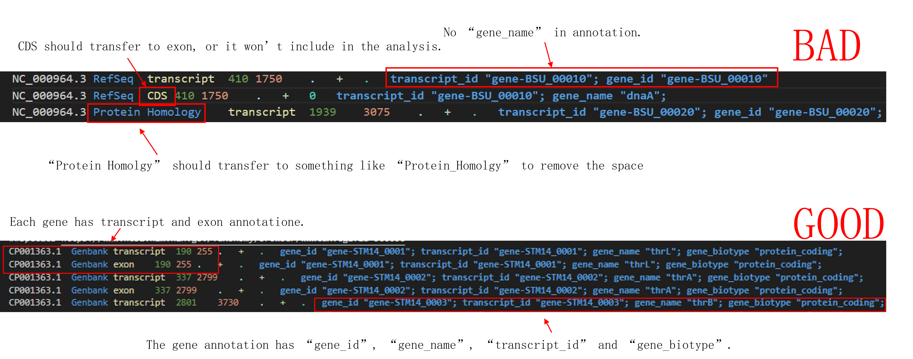

<main>

# MobiVision®-M v1.3 User Manual

- [MobiVision®-M v1.3 User Manual](#mobivision-m-v13-user-manual)
  - [Software Introduction](#software-introduction)
  - [System Requirements](#system-requirements)
  - [Software Installation](#software-installation)
  - [Quick start](#quick-start)
    - [Building the Reference](#building-the-reference)
    - [Gene Quantification Analysis](#gene-quantification-analysis)
  - [Subcommands](#subcommands)
    - [quantify](#quantify)
      - [Input](#input)
      - [Running the Command](#running-the-command)
      - [Optional Parameters](#optional-parameters)
      - [Output](#output)
      - [Matrix Format](#matrix-format)
        - [barcodes.tsv.gz Format](#barcodestsvgz-format)
        - [features.tsv.gz Format](#featurestsvgz-format)
        - [matrix.mtx.gz Format](#matrixmtxgz-format)
      - [Config Format](#config-format)
      - [qc-only Parameter Output](#qc-only-parameter-output)
    - [mkindex](#mkindex)
      - [Input](#input-1)
      - [Running the Command](#running-the-command-1)
      - [Optional Parameters](#optional-parameters-1)
      - [Output](#output-1)
    - [rcmicrobe](#rcmicrobe)
      - [Input](#input-2)
      - [Running the Command](#running-the-command-2)
      - [Optional Parameters](#optional-parameters-2)
      - [Output](#output-2)

<hr>

## Software Introduction  

MobiVision®-M is a bioinformatics analysis software designed to analyze single-cell microbial transcriptomic sequencing data derived from the MobiMicrobe® high-throughput microbial single-cell transcriptomic kit.  
Currently, MobiVision®-M v1.3 includes three subcommands:  
- quantify: This is primarily used for processing single-cell microbial transcriptomic data (in .fastq or .fastq.gz format) and generates analysis reports, gene expression matrices for individual microbes (in .mtx format), and other related files.  
- mkindex: This is used to build the reference genome files required for the quantification analysis.  
- rcmicrobe: This is used to re-call microbes from the results of a completed quantification analysis and generate new reports.  
<hr>

## System Requirements    

- Processor: An 8-core Intel or AMD processor, x86 architecture (16 cores or more is recommended)  
- Memory: 32GB (64GB or more is recommended)  
- Storage Space: 1TB of available space  
- Operating System: Linux operating system, such as 64-bit CentOS 7, ubuntu:22.04, or higher versions are recommended  

<hr>

## Software Installation 

Extract the MobiVision-M_v1.3.tar.gz file. Execute the source command in the shell command line to activate the MobiVision-M v1.3 software environment.  
Each time you open a new shell window or terminal interface, you need to execute the “source” command again.
```
### Extract MobiVision-M
tar -zxvf MobiVision-M_v1.3.tar.gz
### Activate the MobiVision-M runtime environment
source MobiVision-M_v1.3/source.sh
### Test whether MobiVision-M is installed successfully
mobivision-M --help
```

<hr>

## Quick start  

<hr>

### Building the Reference

You need to prepare a genome sequence file, which must be in FASTA format, and a gene annotation file, which must be in GTF format.  
The contig names in the FASTA file of the reference genome must correspond to those in the GTF file. The GTF file for building the reference genome must meet the following requirements:  
1. It must contain both exon and transcript information. Although microbes generally do not distinguish between exons, for the convenience of analysis, the gene annotations can be modified to include both exon and transcript information, with their regions being identical to the original gene regions.
2. No spaces should be present in any columns other than the annotation column. Spaces can be replaced with “-”.
3. The gene annotations must include transcript_id, gene_id, and gene_name. These annotations must be unique for each gene in the GTF file.
3. The gene annotations can include gene_biotype. If this field is present, the software will calculate the proportion of each gene biotype in the results (for example, the proportion of rRNA).  

  
A demo fasta file can be found here: [demo fasta](./user_manual/GCF_000009045.1_ASM904v1_genomic.fna)    
A demo gtf file can be found here: [demo gtf](./user_manual/GCF_000009045.1_modified.gtf)  
After preparing the input files, run the following command:  
```
mobivision-M mkindex \
-n species_name \ # Replace species_name with the name of the species
-f genome_file \ # Replace genome_file with the path to the genome sequence file
-g gtf_file \ # Replace gtf_file with the path to the gene annotation file
-o reference_dir # Replace reference_dir with the output path for the reference
```
The entire reference_dir folder is the constructed reference.

<hr>

### Gene Quantification Analysis

You need to prepare the raw sequencing data folder and the reference. The raw sequencing data folder should contain the raw sequencing files for paired-end sequencing, which have already been demultiplexed.  
After preparing the input files, run the following command:    
```
mobivision-M quantify \
-i reference_dir \ # Replace reference_dir with the path to the reference
-t 12 \ # Number of threads to run
-f data_dir \ # Replace data_dir with the path to the raw sequencing data folder
-o report_dir # Replace report_dir with the output path for the report
```
The report_dir will contain the analysis report (in .html format) and the expression matrix (in COO sparse matrix format).  

<hr>

## Subcommands

<hr>

### quantify 

The quantify command is used to quantify gene expression in individual microorganisms. It generates quality control results, expression matrices, and analysis reports.

<hr>

#### Input

The quantify command requires two essential inputs:
1. Path to the sequencing data folder: The folder containing the raw sequencing data should include all paired-end sequencing files for the sample. Multiple batches of sequencing data can be placed in a single folder, and MobiVision-M will merge the data before analysis. The software recognizes data files in the format prefix_flag_postfix.type, where:  
- prefix is the sample name and must be present.
- flag indicates the paired-end sequencing marker (currently supported: R1, R2, 1, 2). This part is required.  
- postfix (optional) indicates the sequencing batch. This part is not required.  
- type specifies the file format (currently supported: fastq, fq, fastq.gz, fq.gz).  
MobiVision-M will merge R1 and R2 files from different batches with the same prefix and postfix before analysis.
2. Path to the reference. The reference must be generated using the mkindex command. 

<hr>

#### Running the Command
```
mobivision-M quantify \
-f data_dir \ # Replace data_dir with the path to the sequencing data folder
-t 12 \ # Number of threads to run
-i reference \ # Replace reference with the path to the reference folder
-s ID \ # Replace ID with the sample ID
-o output_dir # Replace output_dir with the output path
```

<hr>

#### Optional Parameters  

| Parameter | Default Value	 | Description |
|:--------|:--------|:---------------|
| -f, --fastqDir | None | Path to the sequencing data folder. |
| -t, --threads | 12 | Number of threads to run. |
| -i, --index_dir | None | Path to the reference. |
| -o, --output_dir | None | Output path. Only non-existent paths are supported. The software will not overwrite existing paths. |
| -s, --sample_ID | None | Sample ID. |
| --cr2.2 | False | Use the CellRanger2.2 algorithm for calling microbes. If no other algorithm is specified, MobiVision-M defaults to using EmptyDrop. |
| --cellnumber | None | Use a specified number of cells for calling microbes. The software selects the top n barcodes with the highest UMI counts as microbial barcodes. |
| --hard_filter | None | Use a specified minimum threshold for reads or UMI counts for calling microbes. The software selects barcodes with read or UMI counts above the threshold. For example, "min_UMI:2000", "min_reads:5000". | 
| --UMI_adjust | no_adjust | Specify the UMI correction algorithm. Options include "no_adjust", "step_1", and "step_1_and_2". See software introduction for more details. | 
| --multiplet_method | auto | Specify the algorithm for identifying multiplets. Options include "scaled_softmax", "majority", and "auto". See software introduction for more details. |
| --nosecondary | False | If specified, secondary clustering analysis will not be performed. |
| --keep_bam | False | If specified, the BAM file will be retained. |
| --keep_unmap_reads | False | If specified, unmapped reads will be retained in fastq.gz format. | 
| --host_remove | False | If specified, the host removal process will be performed. |
| --host_reference | None | Path to the host reference. This can be built using mkindex. | 
| --qc_only | False | If specified, only preprocessing will be performed, and clean data FASTQ files, barcode whitelist, and other outputs will be generated. See qc_only section for more details. |
| --kit | v1.0 | Record the kit version used for the sample. |
| --test_run | False | Run a small demo dataset to test the software installation. |
| --config | Na | Specify a configuration file for more detailed parameters. See the config format section for details. |
| -h, --help | False | Display help information. | 

<hr>

#### Output
Taking the sample with --sample_ID as 240131SW_240129B-S-SW-E01 as an example:  
```
tree ./240131SW_240129B-S-SW-E01
./240131SW_240129B-S-SW-E01/
├── 240131SW_240129B-S-SW-E01
│   └── 240131SW_240129B-S-SW-E01_outs
│       ├── 240131SW_240129B-S-SW-E01.h5ad
│       ├── 240131SW_240129B-S-SW-E01.qlentille
│       ├── 240131SW_240129B-S-SW-E01_report.html
│       ├── barcode_info.tsv.gz
│       ├── filtered_cell_gene_matrix
│       │   ├── barcodes.tsv.gz
│       │   ├── features.tsv.gz
│       │   └── matrix.mtx.gz
│       ├── gene_type.json
│       ├── map_stat.tsv
│       ├── raw_cell_gene_matrix
│       │   ├── barcodes.tsv.gz
│       │   ├── features.tsv.gz
│       │   ├── matrix.mtx.gz
│       │   └── UniqueAndMult-Uniform.mtx.gz
│       ├── raw_re-assigned_cell_gene_matrix
│       │   ├── barcodes.tsv.gz
│       │   ├── features.tsv.gz
│       │   └── matrix.mtx.gz
│       └── report.json
├── Job_done.flag
├── logs
│   ├── MobiVision-M.log
│   ├── stderr.log
│   └── stdout.log
└── run_analysis_cmds.txt
```
| File/Folder                             | Format                    | Description                                                                    |
| :-------------------------------------- | :------------------------ | :----------------------------------------------------------------------------- |
| `240131SW_240129B-S-SW-E01_outs`        | Folder                    | Main output directory.                                                         |
| `240131SW_240129B-S-SW-E01.h5ad`        | h5ad                      | Records the dimensionality reduction and clustering results.                   |
| `240131SW_240129B-S-SW-E01.qlentille`   | qlentille                 | Input file for MobiBrowser.                                                    |
| `240131SW_240129B-S-SW-E01_report.html` | html                      | Analysis report file.                                                          |
| `barcode_info.tsv.gz`                   | gzipped tsv               | Records barcode information.                                                   |
| `filtered_cell_gene_matrix`             | Folder                    | Contains filtered matrix files.                                                |
| `raw_cell_gene_matrix`                  | Folder                    | Contains unfiltered and unoptimized matrices.                                  |
| `raw_re-assigned_cell_gene_matrix`      | Folder                    | Contains unfiltered but optimized matrices.                                    |
| `barcodes.tsv.gz`                       | gzipped tsv               | Records barcode information for the matrix.                                    |
| `features.tsv.gz`                       | gzipped tsv               | Records gene information for the matrix.                                       |
| `matrix.mtx.gz`                         | gzipped coo sparse matrix | Records matrix values.                                                         |
| `gene_type.json`                        | json                      | Records gene classification information.                                       |
| `map_stat.tsv`                          | tsv                       | Records mapping statistics for each species.                                   |
| `report.json`                           | json                      | JSON format of the report file, containing all information from `report.html`. |
| `Job_done.flag`                         | txt                       | Indicates successful completion of the run.                                    |
| `run_analysis_cmds.txt`                 | txt                       | Records the commands used for the analysis.                                    |
| `logs`                                  | Folder                    | Log directory.                                                                 |
| `MobiVision-M.log`                      | txt                       | Main log file for the software.                                                |
| `stdout.log`                            | txt                       | Standard output log for third-party tools.                                     |
| `stderr.log`                            | txt                       | Standard error log for third-party tools.                                      |

#### Matrix Format
MobiVision-M outputs the coefficient matrix in COO format. It consists of three files:
- barcodes.tsv.gz: A gzipped tab-separated file recording the matrix barcodes.
- features.tsv.gz: A gzipped tab-separated file recording the gene information.
- matrix.mtx.gz: A gzipped Matrix Market file containing the actual matrix values.

##### barcodes.tsv.gz Format
After decompressing barcodes.tsv.gz, the file contains entries in the following format:  
| |
|----------------------|
| AAACAGCAATAGGTCTCTGT |
| AAACAGCAATCGGACCAACA |
| AAACAGCAATGCCACGGTCT |
| AAACAGCAATGGACGGTATA |
| AAACAGCAATGTTGTTCGTT |
| AAACAGCAATTCATAAGTCG |
| AAACATTATGAACAGTCAAG |
| AAACATTATGAATAGATGAA |
| AAACATTATGCCAGGACGGC |
| AAACATTATGTACGGCACTA |
One barcode each line.

##### features.tsv.gz Format
After decompressing features.tsv.gz, the file contains entries in the following format:  
|  |  |  |
|-----------------|------------|-----------------|
| gene-STM14_0002 | thrA       | Gene Expression |
| gene-STM14_0003 | thrB       | Gene Expression |
| gene-STM14_0004 | thrC       | Gene Expression |
| gene-STM14_0005 | yaaA       | Gene Expression |
| gene-STM14_0006 | yaaJ       | Gene Expression |
| gene-STM14_0007 | talB       | Gene Expression |
| gene-STM14_0008 | mogA       | Gene Expression |
| gene-STM14_0009 | yaaH       | Gene Expression |
| gene-STM14_0010 | htgA       | Gene Expression |
| gene-STM14_0011 | yaaI       | Gene Expression |
| gene-STM14_0012 | STM14_0012 | Gene Expression |
| gene-STM14_0013 | dnaK       | Gene Expression |
| gene-STM14_0014 | dnaJ       | Gene Expression |
| gene-STM14_0015 | STM14_0015 | Gene Expression |
Where:
- The first column is the gene ID.
- The second column is the gene name.
- The third column is the type.

##### matrix.mtx.gz Format
After decompressing matrix.mtx.gz, the file contains entries in the following format:  
|  |      |         |
|----------------------------------------------------|------|---------|
| %%MatrixMarket matrix   coordinate integer general |      |         |
| %                                                  |      |         |
| 5521                                               | 5985 | 1803635 |
| 59                                                 | 1    | 1       |
| 160                                                | 1    | 1       |
| 186                                                | 1    | 1       |
| 198                                                | 1    | 1       |
| 203                                                | 1    | 1       |
| 258                                                | 1    | 1       |
| 259                                                | 1    | 2       |
| 266                                                | 1    | 1       |
| 272                                                | 1    | 1       |
| 359                                                | 1    | 1       |
| 360                                                | 1    | 1       |
| 369                                                | 1    | 1       |
| 392                                                | 1    | 1       |
| 459                                                | 1    | 1       |
| 523                                                | 1    | 1       |
| 556                                                | 1    | 1       |
| 627                                                | 1    | 1       |
| 655                                                | 1    | 1       |
| 693                                                | 1    | 1       |
Where:
+ The first line is always: %%MatrixMarket matrix coordinate integer general
+ The second line is always: %
+ The third line describes the overall matrix dimensions:
  - The first number is the row count (i.e., the number of genes) and must match the number of lines in features.tsv.gz.
  - The second number is the column count (i.e., the number of barcodes) and must match the number of lines in barcodes.tsv.gz.
  - The third number is the total count of non-zero entries in the matrix.
+ Each subsequent line describes one non-zero entry:
  - The first number is the row index.
  - The second number is the column index.
  - The third number is the value at that coordinate, representing the detected UMI count.

<hr>

#### Config Format

The config file can be used to set more detailed parameters for running the software. The config file is not mandatory, and neither are the parameters within it. For any parameters not specified, MobiVision-M will use its internal default values for analysis.  
The config file is divided into two sections: STAR and MobiVision-M.   
The STAR section includes parameters for the STAR aligner software.    
The config file must be in the INI format.   
A demo config file can be found here: [demo config](./user_manual/MobiVision-M_v1.3.ini)    
The available parameters are as follows:    
| Parameter                | Section      | Default Value | Description                                                                                                                  |
| :----------------------- | :----------- | :------------ | :--------------------------------------------------------------------------------------------------------------------------- |
| `soloMultiMappers`       | STAR         | `Uniform`     | Specifies the `soloMultiMappers` parameter for STAR.                                                                         |
| `nExpectedCells`         | STAR         | `3000`        | Specifies the `soloCellFilter` parameter for STAR, which is the first sub-parameter for `EmptyDrops_CR` or `CellRanger2.2`.  |
| `maxPercentile`          | STAR         | `0.99`        | Specifies the `soloCellFilter` parameter for STAR, which is the second sub-parameter for `EmptyDrops_CR` or `CellRanger2.2`. |
| `maxMinRatio`            | STAR         | `10`          | Specifies the `soloCellFilter` parameter for STAR, which is the third sub-parameter for `EmptyDrops_CR` or `CellRanger2.2`.  |
| `indMin`                 | STAR         | `45000`       | Specifies the `soloCellFilter` parameter for STAR, which is the fourth sub-parameter for `EmptyDrops_CR`.                    |
| `indMax`                 | STAR         | `90000`       | Specifies the `soloCellFilter` parameter for STAR, which is the fifth sub-parameter for `EmptyDrops_CR`.                     |
| `umiMin`                 | STAR         | `150`         | Specifies the `soloCellFilter` parameter for STAR, which is the sixth sub-parameter for `EmptyDrops_CR`.                     |
| `umiMinFracMedian`       | STAR         | `0.1`         | Specifies the `soloCellFilter` parameter for STAR, which is the seventh sub-parameter for `EmptyDrops_CR`.                   |
| `candMaxN`               | STAR         | `20000`       | Specifies the `soloCellFilter` parameter for STAR, which is the eighth sub-parameter for `EmptyDrops_CR`.                    |
| `FDR`                    | STAR         | `0.1`         | Specifies the `soloCellFilter` parameter for STAR, which is the ninth sub-parameter for `EmptyDrops_CR`.                     |
| `simN`                   | STAR         | `10000`       | Specifies the `soloCellFilter` parameter for STAR, which is the tenth sub-parameter for `EmptyDrops_CR`.                     |
| `soloUMIfiltering`       | STAR         | `-`           | Specifies the `soloUMIfiltering` parameter for STAR.                                                                         |
| `soloUMIdedup`           | STAR         | `1MM_CR`      | Specifies the `soloUMIdedup` parameter for STAR.                                                                             |
| `allow_multi_target_UMI` | STAR         | `True`        | Whether to allow a UMI to align to multiple locations.                                                                       |
| `reclaim_UMI`            | STAR         | `True`        | Whether to include UMIs aligned to secondary locations in the analysis.                                                      |
| `white_list_file`        | STAR         | `NA`          | Specifies the whitelist to be used.                                                                                          |
| `process_cutadapt`       | MobiVision-M | `True`        | Whether to run `cutadapt` during preprocessing.                                                                              |
| `process_fastp`          | MobiVision-M | `True`        | Whether to run `fastp` during preprocessing.                                                                                 |
| `adpator_list_path`      | MobiVision-M | `NA`          | Path to a custom adapter list file.                                                                                          |

<hr>

#### qc-only Parameter Output
If the --qc_only parameter is specified, MobiVision®-M will only run the preprocessing steps and retain all the preprocessed results.   Taking the output directory 240321B-S-LLY-E10 as an example:  
```
tree ./240321B-S-LLY-E10
./240321B-S-LLY-E10/
├── Job_done.flag
├── logs
│   ├── MobiVision-M.log
│   ├── stderr.log
│   └── stdout.log
├── pre_process
│   ├── 240321B-S-LLY-E10_filter_stat.tsv
│   ├── 240321B-S-LLY-E10_qc_stat.tsv
│   ├── 240321B-S-LLY-E10_sample_barcode_stat.tsv
│   ├── clean_data
│   │   └── 240321B-S-LLY-E10
│   │       ├── 240321B-S-LLY-E10_240321B-S-LLY-E10_S0_L001_R1_001.fastq.gz
│   │       ├── 240321B-S-LLY-E10_240321B-S-LLY-E10_S0_L001_R2_001.fastq.gz
│   │       └── white_list.tsv
│   ├── failed_reads.tsv
│   ├── Job_done.flag
│   ├── pre-process
│   │   └── 240321B-S-LLY-E10
│   │       ├── cutadapt_out
│   │       │   ├── 240321B-S-LLY-E10_combined_clean1_R1.fastq.gz
│   │       │   ├── 240321B-S-LLY-E10_combined_clean1_R2.fastq.gz
│   │       │   └── cutadapt_report.json
│   │       ├── fastp_out
│   │       │   ├── 240321B-S-LLY-E10_fastp-report.html
│   │       │   └── 240321B-S-LLY-E10_fastp-report.json
│   │       └── qc_data.tsv
│   ├── split_fastq
│   │   ├── 240321B-S-LLY-E10
│   │   │   ├── 240321B-S-LLY-E10_240321B-S-LLY-E10_S1_L001_R1_001.fastq.gz
│   │   │   ├── 240321B-S-LLY-E10_240321B-S-LLY-E10_S1_L001_R2_001.fastq.gz
│   │   │   └── white_list.tsv
│   │   └── unknown
│   │       ├── 240321B-S-LLY-E10_unknown_S1_L001_R1_001.fastq.gz
│   │       └── 240321B-S-LLY-E10_unknown_S1_L001_R2_001.fastq.gz
│   └── sub_process_annnote.tsv
└── run_analysis_cmds.txt
```

| File/Folder                                                   | Format        | Description                                                               |
| :------------------------------------------------------------ | :------------ | :------------------------------------------------------------------------ |
| `Job_done.flag`                                               | txt           | Indicates successful completion of the run.                               |
| `run_analysis_cmds.txt`                                       | txt           | Records the commands used for the analysis.                               |
| `logs`                                                        | Folder        | Log directory.                                                            |
| `MobiVision-M.log`                                            | txt           | Main log file for the software.                                           |
| `stdout.log`                                                  | txt           | Standard output log for third-party tools.                                |
| `stderr.log`                                                  | txt           | Standard error log for third-party tools.                                 |
| `pre_process`                                                 | Folder        | Directory containing preprocessing results.                               |
| `240321B-S-LLY-E10_filter_stat.tsv`                           | tsv           | Statistics on reads passing barcode detection.                            |
| `240321B-S-LLY-E10_qc_stat.tsv`                               | tsv           | Statistics on reads passing through `cutadapt`, `fastp`, or host removal. |
| `240321B-S-LLY-E10_sample_barcode_stat.tsv`                   | tsv           | Sample result file records.                                               |
| `failed_reads.tsv`                                            | tsv           | Names of reads that failed barcode detection.                             |
| `sub_process_annnote.tsv`                                     | tsv           | Records of time taken for each process.                                   |
| `split_fastq`                                                 | Folder        | Directory containing output from barcode detection.                       |
| `240321B-S-LLY-E10`                                           | Folder        | Folder containing reads with correct barcode and UMI.                     |
| `240321B-S-LLY-E10_240321B-S-LLY-E10_S1_L001_R1_001.fastq.gz` | gzipped fastq | Contains only the barcode + UMI sequences of the reads.                   |
| `240321B-S-LLY-E10_240321B-S-LLY-E10_S1_L001_R2_001.fastq.gz` | gzipped fastq | Contains the raw data R2 sequences, unprocessed.                          |
| `white_list.tsv`                                              | tsv           | Barcode list for the sample.                                              |
| `unknown`                                                     | Folder        | Folder containing reads with incorrect barcode or UMI.                    |
| `240321B-S-LLY-E10_unknown_S1_L001_R1_001.fastq.gz`           | gzipped fastq | Sequences of reads that failed barcode or UMI detection (R1 end).         |
| `240321B-S-LLY-E10_unknown_S1_L002_R1_001.fastq.gz`           | gzipped fastq | Sequences of reads that failed barcode or UMI detection (R2 end).         |
| `pre-process`                                                 | Folder        | Directory containing results from third-party tools.                      |
| `cutadapt_out`                                                | Folder        | Output directory for `cutadapt`.                                          |
| `fastp_out`                                                   | Folder        | Output directory for `fastp`.                                             |
| `qc_data.tsv`                                                 | tsv           | Statistics on data processing results from third-party tools.             |


<hr>

### mkindex

The mkindex command is used to build the reference files required for the quantify command in MobiVision-M.

<hr>

#### Input

To build the reference required by the quantify command, two files are needed for each species: a genome sequence file and a gene annotation file.  
The genome sequence file must be in FASTA format.   
The gene annotation file must be in GTF format and meet the following requirements:  
1. It must contain both exon and transcript information. Although microbes generally do not distinguish between exons, for the convenience of analysis, the gene annotations can be modified to include both exon and transcript information, with their regions being identical to the original gene regions.
2. No spaces should be present in any columns other than the annotation column. Spaces can be replaced with “-”.
3. The gene annotations must include transcript_id, gene_id, and gene_name, and each of these annotations must be unique for each gene in the GTF file.
4. The gene annotations can include gene_biotype. If this field is present, the software will calculate the proportion of each gene biotype in the results (for example, the proportion of rRNA).    
  

<hr>

#### Running the Command

Building a Single-Species Reference   
```
mobivision-M mkindex \
-n species_name \ # Replace species_name with the name of the species
-f genome_file \ # Replace genome_file with the path to the genome sequence file
-g gtf_file \ # Replace gtf_file with the path to the gene annotation file
-o reference_dir # Replace reference_dir with the output path for the reference
```
Building a Multi-Species Reference  
You can input information for multiple species by repeating the -n, -f, and -g options.   
The order of input for each species must be consistent.  
```
mobivision-M mkindex \
-n species_name1 \ # Replace species_name1 with the name of species 1
-f genome_file1 \ # Replace genome_file1 with the path to the genome sequence file for species 1
-g gtf_file1 \ # Replace gtf_file1 with the path to the gene annotation file for species 1
-n species_name2 \ # Replace species_name2 with the name of species 2
-f genome_file2 \ # Replace genome_file2 with the path to the genome sequence file for species 2
-g gtf_file2 \ # Replace gtf_file2 with the path to the gene annotation file for species 2
-o reference_dir # Replace reference_dir with the output path for the reference
```
Alternatively, you can create a table with the genome and GTF file paths for multiple species and input it using the --input_file option.  
 The table should have columns for name, gtf, and fasta, separated by tabs. For example:  
| name | gtf | fasta |
|:--------|:------------------|:---------------|
| E.coi | /share/home/sc/Projects/microbeRNA-seq/reference_20230808/GCF_000005845.2_modified.gtf | /share/home/sc/Projects/microbeRNA-seq/reference_20230808/GCF_000005845.2_ASM584v2_genomic.fna |
| B.sub | /share/home/sc/Projects/microbeRNA-seq/reference_20230808/GCF_000009045.1_modified.gtf | /share/home/sc/Projects/microbeRNA-seq/reference_20230808/GCF_000009045.1_ASM904v1_genomic.fna |  
```
mobivision-M mkindex \
--input_file genomes_metadata.tsv \
-o combine_ref
```

<hr>

#### Optional Parameters
| Parameter                  | Default Value | Description                                                                                                                                              |
| :------------------------- | :------------ | :------------------------------------------------------------------------------------------------------------------------------------------------------- |
| `-n, --nameOfSpecies`      | None          | Name of the species. Can be repeated for multiple species, but the order must match `-f` and `-g`.                                                       |
| `-f, --fastaPath`          | None          | Path to the genome sequence file for the species. Must be in FASTA format. Can be repeated for multiple species, but the order must match `-n` and `-g`. |
| `-g, --gtfPath`            | None          | Path to the gene annotation file for the species. Must be in GTF format. Can be repeated for multiple species, but the order must match `-n` and `-f`.   |
| `--input_file`             | NA            | Use a tab-separated file to input species information for building the reference.                                                                        |
| `-r, --referenceVerString` | unknown       | Specify the version of the reference.                                                                                                                    |
| `-m, --memoryUsed`         | 64            | Limit the maximum memory used for building the STAR reference. Unit is GB.                                                                               |
| `-o, --output_dir`         | None          | Specify the output path for the reference.                                                                                                               |
| `--test_run`               | False         | Run a small demo dataset to test the software installation.                                                                                              |
| `-h, --help`               | False         | Display help information.                                                                                                                                |

<hr>

#### Output
Taking the output directory E.coil_and_B.sub as an example:    
```
tree ./E.coil_and_B.sub
./E.coil_and_B.sub
├── fasta
│   ├── genome.fa
│   └── genome.fa.fai
├── genes
│   ├── gene_info.json
│   └── genes.gtf
├── Job_done.flag
├── logs
│   ├── MobiVision-M.log
│   ├── stderr.log
│   └── stdout.log
├── reference.json
└── star
    ├── chrLength.txt
    ├── chrNameLength.txt
    ├── chrName.txt
    ├── chrStart.txt
    ├── exonGeTrInfo.tab
    ├── exonInfo.tab
    ├── geneInfo.tab
    ├── Genome
    ├── genomeParameters.txt
    ├── Log.out
    ├── SA
    ├── SAindex
    ├── sjdbInfo.txt
    ├── sjdbList.fromGTF.out.tab
    ├── sjdbList.out.tab
    └── transcriptInfo.tab
```
| File/Folder        | Format | Description                                    |
| :----------------- | :----- | :--------------------------------------------- |
| `fasta`            | Folder | Contains the constructed sequence information. |
| `genome.fa`        | fasta  | Genome sequence file.                          |
| `genome.fa.fai`    | fai    | Index file for the genome sequence.            |
| `genes`            | Folder | Contains the constructed gene information.     |
| `gene_info.json`   | json   | Records gene classification information.       |
| `genes.gtf`        | gtf    | Records gene annotation information.           |
| `Job_done.flag`    | txt    | Indicates successful completion of the run.    |
| `logs`             | Folder | Log directory.                                 |
| `MobiVision-M.log` | txt    | Main log file for the software.                |
| `stdout.log`       | txt    | Standard output log for third-party tools.     |
| `stderr.log`       | txt    | Standard error log for third-party tools.      |
| `star`             | Folder | STAR reference directory.                      |


<hr>

### rcmicrobe

The rcmicrobe command is used to re-call microbes from the results of a completed quantification analysis and generate new analysis results.

<hr>

#### Input 

The rcmicrobe command requires the output directory from a completed quantification analysis.  
This directory typically ends with _outs and contains files such as report.json and barcode_info.tsv.gz.  

<hr>

#### Running the Command 
```
mobivision-M rcmicrobe \
-i analysis_dir \ # Replace with the path to the completed MobiVision-M analysis directory (typically ending with _outs)
-o output_dir \ # Replace with the desired output path
-t 8 \ # Number of threads to run
--cr2.2 \ # Specify the call microbe algorithm
```

<hr>

#### Optional Parameters

| Parameter            | Default Value | Description                                                                                                                                                                                                 |
| :------------------- | :------------ | :---------------------------------------------------------------------------------------------------------------------------------------------------------------------------------------------------------- |
| `-i, --analysis_dir` | None          | Path to the completed MobiVision-M analysis directory (typically ending with `_outs`).                                                                                                                      |
| `-o, --output_dir`   | None          | Desired output path.                                                                                                                                                                                        |
| `-c, --call_mtx`     | None          | Matrix file to use for re-analysis. If not specified, the command will check `raw_re-assigned_cell_gene_matrix` and `raw_cell_gene_matrix` in order.                                                        |
| `-t, --threads`      | 12            | Number of threads to run.                                                                                                                                                                                   |
| `-s, --sample_ID`    | None          | Sample name for the report. If not specified, the sample name from `analysis_dir` will be used.                                                                                                             |
| `--cr2.2`            | False         | Use the CellRanger2.2 algorithm for calling microbes. If no other algorithm is specified, MobiVision-M defaults to using EmptyDrop.                                                                         |
| `--cellnumber`       | None          | Use a specified number of cells for calling microbes. The software selects the top n barcodes with the highest UMI counts as microbial barcodes.                                                            |
| `--hard_filter`      | None          | Use a specified minimum threshold for reads or UMI counts for calling microbes. The software selects barcodes with read or UMI counts above the threshold. For example, "min\_UMI:2000", "min\_reads:5000". |
| `--UMI_adjust`       | no\_adjust    | Specify the UMI correction algorithm. Options include "no\_adjust", "step\_1", and "step\_1\_and\_2". See software introduction for more details.                                                                                                      |
| `--multiplet_method` | auto          | Specify the algorithm for identifying multiplets. Options include "scaled\_softmax", "majority", and "auto". See software introduction for more details.                                                                                               |
| `--nosecondary`      | False         | If specified, secondary clustering analysis will not be performed.                                                                                                                                          |
| `--keep_bam`         | False         | If specified, the BAM file will be retained.                                                                                                                                                                |
| `--kit`              | v1.0          | Record the kit version used for the sample.                                                                                                                                                                 |
| `-h, --help`         | False         | Display help information.                                                                                                                                                                                   |

<hr>

#### Output
Taking the output directory demo as an example:  
```
tree ./demo
./demo/
├── barcode_info.tsv.gz
├── demo.h5ad
├── demo.qlentille
├── demo_report.html
├── filtered_cell_gene_matrix
│   ├── barcodes.tsv.gz
│   ├── features.tsv.gz
│   └── matrix.mtx.gz
├── gene_type.json
├── high_variable_genes.tsv
├── Job_done.flag
├── logs
│   ├── MobiVision-M.log
│   ├── stderr.log
│   └── stdout.log
├── map_stat.tsv
├── raw_cell_gene_matrix
│   ├── barcodes.tsv.gz
│   ├── features.tsv.gz
│   ├── matrix.mtx.gz
│   └── UniqueAndMult-Uniform.mtx
├── raw_re-assigned_cell_gene_matrix
│   ├── barcodes.tsv.gz
│   ├── features.tsv.gz
│   └── matrix.mtx.gz
└── report.json
```

| File/Folder                        | Format      | Description                                                                         |
| :--------------------------------- | :---------- | :---------------------------------------------------------------------------------- |
| `demo.h5ad`                        | h5ad        | Records the dimensionality reduction and clustering results.                        |
| `demo.qlentille`                   | qlentille   | Input file for MobiBrowser.                                                         |
| `demo_report.html`                 | html        | Analysis report file.                                                               |
| `barcode_info.tsv.gz`              | gzipped tsv | Records barcode information.                                                        |
| `filtered_cell_gene_matrix`        | Folder      | Contains filtered matrix files.                                                     |
| `raw_cell_gene_matrix`             | Folder      | Contains unfiltered and unoptimized matrices.                                       |
| `raw_re-assigned_cell_gene_matrix` | Folder      | Contains unfiltered but optimized matrices.                                         |
| `barcodes.tsv.gz`                     | compressed tsv         | Records barcode information for the matrix.                                         |
| `features.tsv.gz`                     | compressed tsv         | Records gene information for the matrix.                                            |
| `matrix.mtx.gz`                       | compressed mtx         | Records matrix values.                                                              |
| `gene_type.json`                   | json        | Records gene classification information.                                            |
| `map_stat.tsv`                     | tsv         | Records mapping statistics for each species.                                        |
| `high_variable_genes.tsv`          | tsv         | High variability genes used in the dimensionality reduction and clustering results. |
| `report.json`                      | json        | JSON format of the report file, containing all information from `demo_report.html`. |
| `Job_done.flag`                    | txt         | Indicates successful completion of the run.                                         |
| `run_analysis_cmds.txt`            | txt         | Records the commands used for the analysis.                                         |
| `logs`                             | Folder      | Log directory.                                                                      |
| `MobiVision-M.log`                 | txt         | Main log file for the software.                                                     |
| `stdout.log`                       | txt         | Standard output log for third-party tools.                                          |
| `stderr.log`                       | txt         | Standard error log for third-party tools.                                           |

</main>

<style>
    img {
        max-width: 80%;
        object-fit: cover; /* 保持图片比例 */
    }
        .code-block {
        max-width: 80%; /* 限制最大宽度 */
        margin: 20px auto; /* 水平居中 */
        padding: 10px;
        background-color: #f4f4f4;
        border: 1px solid #ddd;
        overflow-x: auto; /* 水平滚动条 */
        font-family: monospace;
    }

    pre {
        margin: 0;
        white-space: pre-wrap; /* 保留空格和换行符 */
        word-wrap: break-word; /* 自动换行 */
    }
</style>